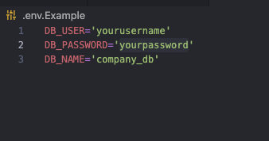
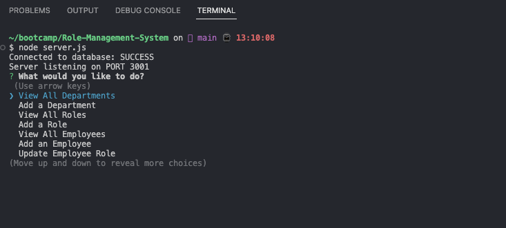
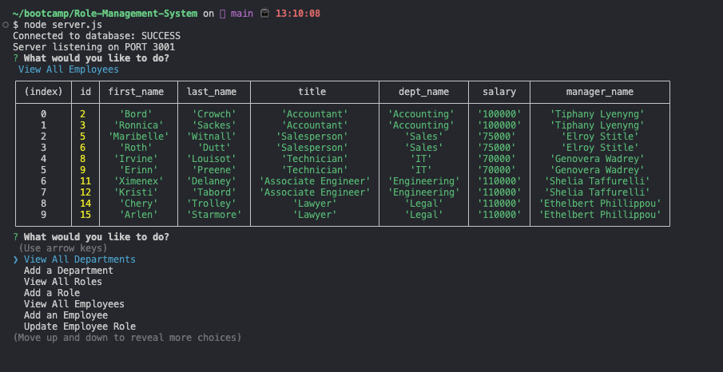
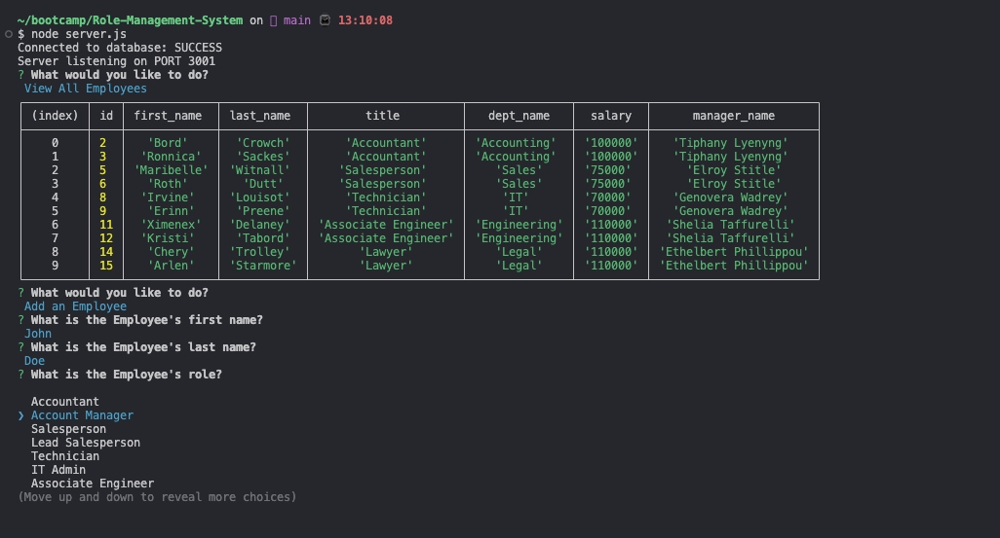

# Role-Management-System (RMS) 

  [](https://opensource.org/licenses/MIT)

  ## Description
  
  This project was created for the manager of a company create be able to manage the departments, roles, and employee information within a CLI program that updates and pulls all the current information currently stored in the database. This program used Node/Express.js and MySQL to build a functional Database Management System. Implementing SQL queries to return the desired information proved to be a challenge within express. The program also uses the Inquirer NPM package for the prompts and navigation provided to the user. Overall this project challenged me a substantial amount and required a lot of reading to get a much clearer understanding of how much can be achieved with just implementing JS and SQL. As such, the project aided in furthering my understanding of both languages.
  
  ## Table of Contents
  
  - [Installation](#installation)
  - [Usage](#usage)
  - [Credits](#credits)
  - [License](#license)
  - [Contributions](#how-to-contribute)
  - [Tests](#tests)
  - [Questions](#questions)
  
  ## Installation
  
  Navigate to: https://www.github.com/alexanderolivares13/Role-Mangement-System <br> and clone the repository to any location on your computer.
  
  ## Usage

  Video walkthrough on how to use and initialize the program: https://drive.google.com/file/d/1Sgfl233TUgUuQReLR6eY17I9o9ludnec/view <br>

  Navigate to the RMS folder in the terminal/bash and initialize MySQL using from the root RMS folder run: <br> ```SOURCE db/schema.sql```  
  after:
  <br> ```SOURCE db/seeds.sql```<br>
  These two commands should only be used when running the application for the first time to set up the database. <br> 
  Next: <br>
  Open the .env.Example file and remove the ".Example" suffix and set up YOUR MySQL user and password to allow the program to access the database: <br>
  <br>
  Lastly, after you setup the .env file you can run in the terminal: <br>
  ```npm install``` <br>
  to ensure all the necessary packages are installed for the program to use. Then:<br>
  ```node server.js```<br>
  to initialize the application:<br>
  <br>
  Select an option by navigating and pressing enter. Here are a few examples: <br>
  
  


  ## Credits
  
  N/A

  ## License

  This project is licensed under the MIT License

  ## How to Contribute
  
  N/A
  
  ## Tests
  
  N/A

  ## Questions
  
  My work can be found on Github at [alexanderolivares13](https://www.github.com/alexanderolivares13)

  If you have any further questions you can contact me at my email at: [alexander.olivares1310@gmail.com](mailto:alexander.olivares1310@gmail.com)


